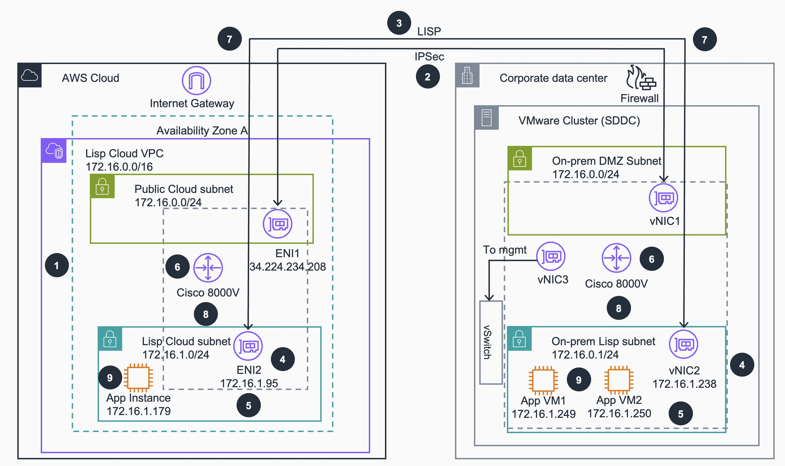

# Guidance for Automated Deployment of Layer 2 Stretch Network Extensions with Cisco 8000v on AWS

## Table of Contents

### Required

1. [Overview](#overview)
    - [Architecture](#architecture)
    - [Cost](#cost)
3. [Prerequisites](#prerequisites)
    - [Operating System](#operating-system)
4. [Deployment Steps](#deployment-steps)
5. [Deployment Validation](#deployment-validation)
6. [Running the Guidance](#running-the-guidance)
7. [Next Steps](#next-steps)
8. [Cleanup](#cleanup)
9. [Licenses](#license)
10. [Notices](#notices)
11. [Authors](#authors)

## Overview

This guidance enables enterprise customers to seamlessly extend on-premises network subnets to AWS using Cisco Catalyst 8000V routers and LISP (Locator/ID Separation Protocol) technology. It solves the critical problem of migrating legacy applications with hardcoded IP addresses to AWS without requiring complex IP reconfiguration.

**Why was this Guidance built?**

Many enterprise applications, particularly legacy systems and workloads running in on-premises virtualized environments, have hardcoded IP addresses and complex network dependencies that make cloud migration challenging. Customers migrating from platforms such as VMware vSphere often face this problem at scale. Changing IP addresses during migration can lead to extended downtime, increased risks, and complex reconfiguration across interconnected systems. This Guidance provides a Layer 2 network extension solution that allows virtual machines to migrate to AWS while maintaining their original IP addresses, ensuring business continuity and reducing migration complexity.


**Note:** This guidance focuses on the AWS cloud-side infrastructure deployment. A companion CloudFormation template (`L2E-lisp-on-prem-vpc-v3.yaml`) is provided for lab testing purposes to simulate an on-premises environment within AWS, but production deployments would connect to actual on-premises Cisco routers.

## Architecture

**High Level Architecture Overview:**

```
┌──────────────────────┐    IPSec/LISP Tunnel      ┌─────────────────────┐
│   On-Premises        │◄─────────────────────────►│     AWS Cloud       │
│   VMware vSphere     │                           │                     │
│                      │                           │                     │
│  ┌───────────────┐   │                           │  ┌───────────────┐  │
│  │ Cisco 8000V   │   │                           │  │ Cisco 8000V   │  │
│  │ (Physical or  │   │                           │  │ (EC2 Instance)│  │
│  │  Virtual)     │   │                           │  │               │  │
│  └───────────────┘   │                           │  └───────────────┘  │
│         │            │                           │         │           │
│  ┌─────────────┐     │                           │  ┌─────────────┐    │
│  │  Extended   │     │                           │  │  Extended   │    │
│  │  Subnet     │     │                           │  │  Subnet     │    │
│  │172.16.1.0/24│     │                           │  │172.16.1.0/24│    │
│  └─────────────┘     │                           │  └─────────────┘    │
└──────────────────────┘                           └─────────────────────┘
```

**High-Level Architecture Flow:**

1. **VPC Infrastructure**: Deploys a VPC with public and private subnets in AWS
2. **Cisco 8000V Deployment**: Launches a Cisco Catalyst 8000V router instance with dual network interfaces
3. **IPSec Tunnel**: Establishes encrypted IPSec tunnel between on-premises and AWS
4. **LISP Configuration**: Enables dynamic endpoint registration and Layer 2 adjacency
5. **OSPF Routing**: Provides routing protocol convergence between sites
6. **Layer 2 Extension**: Allows VMs in the extended subnet to communicate seamlessly across sites

**Detailed Reference Architecture**



**Detailed Reference Architecture Flow**

1. AWS CloudFormation deploys the infrastructure, provisioning both the AWS Cloud and on-premises Cisco Catalyst 8000V routers with pre-configured LISP, IPSec, and OSPF settings.

2. A secure IPSec tunnel is established between the on-premises Cisco Catalyst 8000V via Virtual Network Interface Card 1 (vNIC1) and the AWS Cisco Catalyst 8000V via Elastic Network Interface1 (ENI1) through the AWS Internet Gateway.

3. The LISP protocol initializes on both routers, separating endpoint identifiers (EIDs) from routing locators (RLOCs) to enable Layer 2 network extension.

4. Secondary IP addresses are configured on router interfaces, Elastic Network Interface2 (ENI2) on the AWS side. vNIC2 on-prem learns hosts directly through ARP broadcasts.  This activate the Layer 2 extension capability.

5. Traffic originates from either environment, whether from on-premises application virtual machines (App VM1: 172.16.1.249, App VM2: 172.16.1.250) or from the AWS Cloud (App Instance: 172.16.1.179).

6. The Cisco Catalyst 8000V (either on-premises or AWS Cloud) encapsulates Layer 2 frames with LISP headers to enable transport across Layer 3 networks.

7. The encapsulated traffic is encrypted using IPSec and transmitted through the secure tunnel via the AWS Internet Gateway on the AWS Cloud side and Firewall on the Corporate data center

8. The destination Cisco Catalyst 8000V (either AWS Cloud or on-premises) decrypts and decapsulates the traffic, then routes it to the appropriate subnet via ENI2 or vNIC2.

9. The packets reach their destination application, maintaining the original Layer 2 addressing throughout the entire flow regardless of traffic direction.

### Cost

You are responsible for the cost of the AWS services used while running this Guidance. As of November 2024, the cost for running this Guidance with the default settings in the US East (N. Virginia) Region is approximately **$140-$200 per month** for a basic deployment with `c5n.large` instance type, depending on data transfer volumes and optional resource selections.

We recommend creating a [Budget](https://docs.aws.amazon.com/cost-management/latest/userguide/budgets-managing-costs.html) through [AWS Cost Explorer](https://aws.amazon.com/aws-cost-management/aws-cost-explorer/) to help manage costs. Prices are subject to change. For full details, refer to the pricing webpage for each AWS service used in this Guidance.

### Sample Cost Table

The following table provides a sample cost breakdown for deploying this Guidance with the default parameters in the US East (N. Virginia) Region for one month.

| AWS Service | Dimensions | Cost [USD] |
| ----------- | ------------ | ------------ |
| Amazon EC2 (Cisco 8000V) | c5n.large instance, 730 hours/month | $78.84/month |
| Amazon EC2 (Test Instance) | t3.micro instance, 730 hours/month | $7.59/month |
| Elastic IP Address | 1 EIP attached to 8000V, 730 hours/month | $3.65/month |
| NAT Gateway | 1 NAT Gateway, 100 GB processed | $37.35/month |
| VPC | Standard VPC, subnet, routing | $0.00 |
| CloudWatch Logs (VPC Flow Logs) | ~10 GB ingested/month | $5.00/month |
| Data Transfer | 100 GB out to Internet | $9.00/month |
| **Total Estimated Cost** | | **~$140-$200/month** |

**Note:** Costs will vary based on:
- EC2 Instance type selection (larger instances for higher throughput)
- Data transfer volumes
- EC2/Compute Savings plans (recommended)
- Cisco C8000v License cost (purchased directly with Cisco/Partner)

## Prerequisites

### Operating System

These deployment instructions work on **macOS, Linux, or Windows**. The CloudFormation template can be deployed entirely from the AWS Management Console (a web browser is the only requirement) or from a terminal using the AWS CLI.

**Required Tools:**

- A web browser with access to the AWS Management Console (Option 1).
- AWS CLI v2.x — only required for the CLI-based deployment (Option 2). Verify with `aws --version`.

### Third-party tools

**Cisco Catalyst 8000V License**
- The BYOL Marketplace AMI includes a rate-limited perpetual license suitable for evaluation and testing
- A license purchased directly from Cisco is required for production throughput and Cisco TAC support
- Subscribe to [Cisco Catalyst 8000V](https://aws.amazon.com/marketplace/pp/prodview-gvkcuwm3c6dru) in AWS Marketplace before deployment

### AWS account requirements

**Required Pre-requisites:**

1. **AWS Marketplace Subscription**
   - Subscribe to [Cisco Catalyst 8000V](https://aws.amazon.com/marketplace/pp/prodview-gvkcuwm3c6dru) in AWS Marketplace
   
2. **EC2 Key Pair**
   - Create an EC2 key pair in your target region for SSH access
   
3. **IAM Permissions**
   - CloudFormation full access
   - EC2 full access
   - VPC full access
   - IAM role creation permissions
   
4. **VPC Quotas**
   - Ensure sufficient VPC quota for creating new VPCs
   - Default limit: 5 VPCs per region (can be increased)

5. **Elastic IP Address**
   - Requires 1 available Elastic IP for the 8000V public interface
   - Default limit: 5 EIPs per region (can be increased)

### Service limits

**Critical Service Limits:**

- **EC2 Instance Limits**: Ensure your account has sufficient quota for `c5n.large` instances (or your chosen instance type)
- **Elastic Network Interfaces**: Each deployment requires multiple ENIs
- **IPv4 CIDR Blocks**: Ensure your chosen CIDR blocks don't conflict with existing VPCs
- **Secondary Private IPs per ENI**: Default limit is ~50 per ENI (varies by instance type)
- **IPv4 Prefixes per ENI**: Scales better than secondary IPs (up to 464 IPs on `c5n.4xlarge` with 29 prefixes)

To request limit increases, visit the [AWS Service Quotas console](https://console.aws.amazon.com/servicequotas/).

### Supported Regions

This Guidance includes AMI mappings for **32 AWS Regions**, including commercial, GovCloud, and newer regions. The CloudFormation template will deploy in any region listed in the AMI mappings section of the template.

**Note:** IOS-XE version 17.13.01a is not available in all regions (`ap-east-2`, `mx-central-1`, `ap-southeast-5`, `ap-southeast-7`). Use version 17.15.03a (default) or 17.09.08 in those regions.

## Deployment Steps

Follow these steps to deploy the L2 Stretch Network solution:

### Option 1: Deploy via the AWS CloudFormation Console (Recommended)

This option uses only a web browser — no CLI, scripts, or local tooling required.

1. **Download the CloudFormation template**

   Either clone the repository:
   ```bash
   git clone https://github.com/jleatham/guidance-for-l2-stretch-network-with-cisco-8000v.git
   ```
   Or download `deployment/L2E-lisp-cloud-vpc.yaml` directly from the repository's GitHub page (open the file, click **Raw**, then **Save Page As**).

2. **Open the CloudFormation console**

   Sign in to the AWS Management Console, switch to your target Region (must be one of the [supported Regions](#supported-regions)), and open the [CloudFormation console](https://console.aws.amazon.com/cloudformation/).

3. **Create a new stack**

   1. Choose **Create stack** → **With new resources (standard)**.
   2. Under **Specify template**, select **Upload a template file**, click **Choose file**, and select the `L2E-lisp-cloud-vpc.yaml` file you downloaded in Step 1.
   3. Choose **Next**.

4. **Specify stack details**

   Enter a stack name (for example, `lisp-cloud-extension`), then fill in the parameters. Parameters are grouped on the form to match the template's `ParameterGroups`.

   **Network Configuration**
   | Parameter | Required? | Guidance |
   |---|---|---|
   | `LispCloudVpcCidr` | Optional | VPC CIDR for the AWS side. Default `172.16.0.0/16`. Must be a superset of the stretched subnet and must not overlap any existing on-prem or AWS network. |
   | `LispCloudPublicSubnetCidr` | Optional | Public subnet for the 8000V's external interface. Default `172.16.0.0/24`. Must be inside the VPC CIDR. |
   | `LispCloudPrivateSubnetCidr` | Optional | The subnet that is stretched between on-prem and AWS. Default `172.16.1.0/24`. Must match the on-prem subnet you intend to extend. |
   | `LispCloud8KvPrivateInterfaceIP` | Optional | Specific IP for the 8000V private interface. Leave blank for automatic assignment. |

   **8Kv Instance Configuration**
   | Parameter | Required? | Guidance |
   |---|---|---|
   | `LispCloud8KvInstanceType` | Required | EC2 instance type. Default `c5n.large`. Use larger c5n/c6in instances for higher throughput. |
   | `LispCloud8KvVersion` | Required | Cisco IOS-XE version. Default `8kv171503a`. Note: `8kv171301a` is not available in `ap-east-2`, `mx-central-1`, `ap-southeast-5`, or `ap-southeast-7`. |
   | `Hostname` | **Required** | Hostname applied to the Cisco 8000V (e.g., `lisp-cloud-router`). |
   | `AuthenticationType` | Required | `KeyPair` (default, recommended) or `UsernamePassword`. |
   | `KeyName` | **Required if `AuthenticationType` = KeyPair** | Name of an existing EC2 key pair in this Region. Create one in the EC2 console first if needed. |
   | `Username` | Required if `AuthenticationType` = UsernamePassword | Admin username for the router. |
   | `PrivilegePwd` | Required if `AuthenticationType` = UsernamePassword | Admin password (NoEcho — not displayed in the console or stored in the events log). |

   **LISP Configuration**
   | Parameter | Required? | Guidance |
   |---|---|---|
   | `LispCloudLoopback` | Optional | RLOC for the AWS 8000V. Default `33.33.33.33`. Used only inside the IPSec tunnel; do not pick a value that conflicts with addresses you actually route. |
   | `LispOnPremLoopback` | Optional | RLOC for the on-prem 8000V. Default `11.11.11.11`. Same constraint as above and must match the on-prem router's loopback. |

   **IPSec Configuration**
   | Parameter | Required? | Guidance |
   |---|---|---|
   | `IPSecPreShareKey` | **Required** | Pre-shared key for the IPSec/LISP tunnel (NoEcho). The on-prem router must use the same value. |
   | `TunnelDestinationPublicIP` | **Required** | Public IP of your on-prem Cisco router (the IPSec peer). Must be a single IP, not a CIDR. |

   **Security Configuration**
   | Parameter | Required? | Guidance |
   |---|---|---|
   | `ParticipantIPAddress` | **Required** | Your administrative IP in `x.x.x.x/32` form. Used to scope the public security group rules for SSH, HTTPS, and ICMP. Find your IP at <https://checkip.amazonaws.com/>. |

   **Application Server Configuration**
   | Parameter | Required? | Guidance |
   |---|---|---|
   | `DeployAppServer` | Optional | `Yes` (default) deploys a small `t3.micro` test web server in the stretched subnet. `No` skips it. |

   Choose **Next**.

5. **Configure stack options**

   Defaults are fine for most deployments. Optionally add tags. Choose **Next**.

6. **Review and create the stack**

   Review the parameters, scroll to the bottom, **acknowledge** that CloudFormation will create IAM resources, and choose **Submit**.

7. **Monitor stack creation**

   Stack creation typically completes in 5–10 minutes. Watch the **Events** tab; the stack should reach `CREATE_COMPLETE`.

8. **Retrieve stack outputs**

   Open the **Outputs** tab. Note the values for `LispCloud8KvPublicIp`, `C8KVInstanceId`, `LispCloud8KvPrivateInterfaceId`, and (if deployed) `LispCloudAppServerPrivateIp` — you will need them to configure the on-prem side and to validate the deployment.

### Option 2: Deploy via AWS CLI

1. **Clone the repository**
   ```bash
   git clone https://github.com/jleatham/guidance-for-l2-stretch-network-with-cisco-8000v.git
   cd guidance-for-l2-stretch-network-with-cisco-8000v
   ```

2. **Deploy the CloudFormation stack**
   ```bash
   aws cloudformation create-stack \
     --stack-name lisp-cloud-extension \
     --template-body file://deployment/L2E-lisp-cloud-vpc.yaml \
     --parameters \
       ParameterKey=LispCloudVpcCidr,ParameterValue=172.16.0.0/16 \
       ParameterKey=LispCloudPublicSubnetCidr,ParameterValue=172.16.0.0/24 \
       ParameterKey=LispCloudPrivateSubnetCidr,ParameterValue=172.16.1.0/24 \
       ParameterKey=LispCloud8KvInstanceType,ParameterValue=c5n.large \
       ParameterKey=LispCloud8KvPrivateInterfaceIP,ParameterValue='' \
       ParameterKey=ParticipantIPAddress,ParameterValue=1.2.3.4/32 \
       ParameterKey=Hostname,ParameterValue=lisp-cloud-router \
       ParameterKey=AuthenticationType,ParameterValue=KeyPair \
       ParameterKey=KeyName,ParameterValue=your-key-name \
       ParameterKey=Username,ParameterValue=admin \
       ParameterKey=PrivilegePwd,ParameterValue=<YOUR-PASSWORD> \
       ParameterKey=LispCloudLoopback,ParameterValue=33.33.33.33 \
       ParameterKey=LispOnPremLoopback,ParameterValue=11.11.11.11 \
       ParameterKey=IPSecPreShareKey,ParameterValue=<YOUR-IPSEC-PRESHARED-KEY> \
       ParameterKey=TunnelDestinationPublicIP,ParameterValue=12.34.56.78 \
     --capabilities CAPABILITY_IAM \
     --profile <YOUR-PROFILE>
   ```

3. **Monitor stack creation**
   ```bash
   aws cloudformation wait stack-create-complete \
     --stack-name lisp-cloud-extension \
     --profile <YOUR-PROFILE>
   ```

4. **Retrieve important outputs**
   ```bash
   # Get 8000v public IP address
   aws cloudformation describe-stacks \
     --stack-name lisp-cloud-extension \
     --query 'Stacks[0].Outputs[?OutputKey==`LispCloud8KvPublicIp`].OutputValue' \
     --output text
   
   # Get 8000v instance ID
   aws cloudformation describe-stacks \
     --stack-name lisp-cloud-extension \
     --query 'Stacks[0].Outputs[?OutputKey==`C8KVInstanceId`].OutputValue' \
     --output text
   
   # Get private ENI ID
   aws cloudformation describe-stacks \
     --stack-name lisp-cloud-extension \
     --query 'Stacks[0].Outputs[?OutputKey==`LispCloud8KvPrivateInterfaceId`].OutputValue' \
     --output text
   ```
> NOTE: please see the [Implementation Guide](https://github.com/aws-solutions-library-samples/guidance-for-l2-stretch-network-with-cisco-8000v/edit/main/README.md) for detailed steps for deployment and validation of this guidance 

## Deployment Validation

### Validate CloudFormation Stack

1. **Check stack status**
   ```bash
   aws cloudformation describe-stacks \
     --stack-name lisp-cloud-extension \
     --query 'Stacks[0].StackStatus' \
     --output text
   ```
   
   Expected output: `CREATE_COMPLETE`

2. **Verify all resources created**
   ```bash
   aws cloudformation describe-stack-resources \
     --stack-name lisp-cloud-extension \
     --output table
   ```

### Validate EC2 Instances

3. **Verify Cisco 8000V instance is running**
   ```bash
   INSTANCE_ID=$(aws cloudformation describe-stacks \
     --stack-name lisp-cloud-extension \
     --query 'Stacks[0].Outputs[?OutputKey==`C8KVInstanceId`].OutputValue' \
     --output text)
   
   aws ec2 describe-instances \
     --instance-ids $INSTANCE_ID \
     --query 'Reservations[0].Instances[0].State.Name' \
     --output text
   ```
   
   Expected output: `running`

### Validate Network Configuration

4. **Verify Elastic IP association**
   ```bash
   aws ec2 describe-addresses \
     --filters "Name=instance-id,Values=$INSTANCE_ID" \
     --query 'Addresses[0].PublicIp' \
     --output text
   ```

5. **Verify ENI attachments**
   ```bash
   aws ec2 describe-instances \
     --instance-ids $INSTANCE_ID \
     --query 'Reservations[0].Instances[0].NetworkInterfaces[*].{Index:Attachment.DeviceIndex,ENI:NetworkInterfaceId,PrivateIP:PrivateIpAddress}' \
     --output table
   ```
   
   Expected: Two network interfaces (index 0 and 1)

### Validate Cisco 8000V Configuration

6. **SSH to Cisco 8000V**
   ```bash
   PUBLIC_IP=$(aws cloudformation describe-stacks \
     --stack-name lisp-cloud-extension \
     --query 'Stacks[0].Outputs[?OutputKey==`LispCloud8KvPublicIp`].OutputValue' \
     --output text)
   
   ssh -i your-key.pem admin@$PUBLIC_IP
   ```

7. **Verify LISP configuration**
   ```cisco
   show ip lisp
   show ip lisp database
   show running-config | section lisp
   ```

8. **Verify IPSec configuration**
   ```cisco
   show crypto isakmp sa
   show crypto ipsec sa
   show running-config | section crypto
   ```

## Running the Guidance

### Initial Setup

After successful deployment, configure the on-premises side and test connectivity:

### 1. Configure On-Premises Cisco 8000V

Deploy matching configuration on your on-premises Cisco router:

```cisco
! Configure loopback interface
interface Loopback1
 ip address 11.11.11.11 255.255.255.255

! Configure IPSec
crypto isakmp policy 200
 encryption aes
 hash sha
 authentication pre-share
 group 21
 lifetime 28800
 
crypto isakmp key <YOUR-PRESHARED-KEY> address 0.0.0.0
crypto isakmp keepalive 10 10

crypto ipsec transform-set dmvpn esp-aes esp-sha-hmac
 mode tunnel

crypto ipsec profile Catalyst8000v1
 set transform-set dmvpn

! Configure tunnel (replace AWS_8KV_PUBLIC_IP with actual IP)
interface Tunnel0
 ip address 12.0.0.1 255.255.255.0
 ip mtu 1400
 ip tcp adjust-mss 1360
 tunnel source GigabitEthernet1
 tunnel mode ipsec ipv4
 tunnel destination <AWS_8KV_PUBLIC_IP>
 tunnel protection ipsec profile Catalyst8000v1

! Configure LISP
router lisp
 locator-set onprem
  11.11.11.11 priority 1 weight 100
 exit-locator-set
 service ipv4
  itr map-resolver 33.33.33.33
  itr
  etr map-server 33.33.33.33 key <YOUR-PRESHARED-KEY>
  etr
  use-petr 33.33.33.33
 exit-service-ipv4
 instance-id 0
  dynamic-eid subnet1
   database-mapping 172.16.1.0/24 locator-set onprem
   map-notify-group 239.0.0.1
  exit-dynamic-eid
  service ipv4
   eid-table default
  exit-service-ipv4
 exit-instance-id
exit-router-lisp

! Configure OSPF
router ospf 1
 network 12.0.0.0 0.0.0.255 area 0
 network 11.11.11.11 0.0.0.0 area 0
```

### 2. Verify Tunnel Establishment

**On AWS 8000V:**
```cisco
show crypto isakmp sa
! Expected: QM_IDLE state

show crypto ipsec sa
! Expected: Active SAs with encaps/decaps counters incrementing

show ip ospf neighbor
! Expected: Neighbor 12.0.0.1 in FULL state
```

**On On-Premises 8000V:**
```cisco
show crypto isakmp sa
show crypto ipsec sa
show ip ospf neighbor
! Expected: Neighbor 12.0.0.2 in FULL state
```

### 3. Verify LISP Registration

```cisco
show ip lisp map-cache
! Expected: See mappings for remote subnet

show ip lisp database
! Expected: See local subnet mappings

show ip lisp statistics
! Expected: Map-Requests/Replies counters incrementing
```

### 4. Test Connectivity

**From AWS test instance:**
```bash
# Get test instance private IP
aws cloudformation describe-stacks \
  --stack-name lisp-cloud-extension \
  --query 'Stacks[0].Outputs[?OutputKey==`LispCloudAppServerPrivateIp`].OutputValue' \
  --output text

# SSH to test instance and ping on-premises
ping <on-prem-server-ip>
```

### Expected Output

**Successful Deployment Indicators:**
- IPSec tunnel status: `QM_IDLE`
- OSPF neighbor state: `FULL`
- LISP map-cache populated with remote subnet
- Ping successful between AWS and on-premises subnets
- Continuous packet flow without drops

### 5. Configure IPv4 Prefixes for Scale (Optional)

For deployments requiring Layer 2 extension support for many on-premises endpoints, IPv4 prefixes provide superior scalability compared to individual secondary IP addresses. Instead of managing IPs one at a time (limited to ~50 per ENI), IPv4 prefixes allow you to allocate entire /28 subnets to the Cisco 8000V's private network interface. Each /28 prefix provides 16 usable IP addresses, and instance types like `c5n.4xlarge` support up to 29 prefixes, enabling connectivity for up to 464 on-premises endpoints through a single Cisco 8000V instance.

This approach is essential for enterprise migrations where hundreds of on-premises servers with static IP addresses need to maintain their addresses while moving workloads to AWS. The prefixes enable the LISP protocol to properly register and route traffic for all on-premises endpoint IPs through the Layer 2 extension tunnel.

**Scalability with IPv4 Prefixes:**
- `c5n.large`: Up to 144 IPs (9 prefixes × 16 IPs each)
- `c5n.2xlarge`: Up to 224 IPs (14 prefixes × 16 IPs each)
- `c5n.4xlarge`: Up to 464 IPs (29 prefixes × 16 IPs each)

#### Step 1: Retrieve the Private ENI ID

First, get the private network interface ID from your CloudFormation stack outputs:

```bash
PRIVATE_ENI=$(aws cloudformation describe-stacks \
  --stack-name lisp-cloud-extension \
  --query 'Stacks[0].Outputs[?OutputKey==`LispCloud8KvPrivateInterfaceId`].OutputValue' \
  --output text)

echo "Private ENI ID: $PRIVATE_ENI"
```

#### Step 2: Plan Your /28 Prefix Allocations

For a 172.16.1.0/24 private subnet:

```bash
# /28 subnets provide 16 IPs each
172.16.1.0/28    → 172.16.1.0 - 172.16.1.15    (16 IPs)
172.16.1.16/28   → 172.16.1.16 - 172.16.1.31   (16 IPs)
172.16.1.32/28   → 172.16.1.32 - 172.16.1.47   (16 IPs)
172.16.1.48/28   → 172.16.1.48 - 172.16.1.63   (16 IPs)
172.16.1.64/28   → 172.16.1.64 - 172.16.1.79   (16 IPs)
172.16.1.80/28   → 172.16.1.80 - 172.16.1.95   (16 IPs)
172.16.1.96/28   → 172.16.1.96 - 172.16.1.111  (16 IPs)
172.16.1.112/28  → 172.16.1.112 - 172.16.1.127 (16 IPs)
172.16.1.128/28  → 172.16.1.128 - 172.16.1.143 (16 IPs)
# ... and so on
```

**Important:** All 16 IPs in each /28 are usable, including boundary addresses (e.g., .16 and .31 in a .16/28 range).

#### Step 3: Assign IPv4 Prefixes via AWS Console

1. Navigate to the **EC2 Console** → **Network Interfaces**
2. Search for the ENI ID from step 1
3. Select the network interface and choose **Actions** → **Manage IP addresses**
4. In the **IPv4 Prefixes** section, click **Assign new IP prefix**
5. Enter your /28 CIDR blocks (e.g., `172.16.1.16/28`)
6. Add additional prefixes as needed for your on-premises endpoints
7. Click **Save**

#### Step 4: Verify Prefix Assignment

You can verify the assigned prefixes in the EC2 console under the network interface details, or use AWS CLI:

```bash
aws ec2 describe-network-interfaces \
  --network-interface-ids $PRIVATE_ENI \
  --query 'NetworkInterfaces[0].Ipv4Prefixes[*].Ipv4Prefix' \
  --output table
```

#### Best Practices for IPv4 Prefix Management

1. **Plan Your Addressing**
   - Document which /28 ranges correspond to on-premises server groups
   - Leave the first /28 (172.16.1.0/28) for AWS resources if needed
   - Assign consecutive /28 blocks for easier management

2. **Scale Appropriately**
   - Choose instance type based on the number of on-premises endpoints
   - Each /28 supports 16 on-premises servers
   - Calculate: `Required_Prefixes = ceil(Total_OnPrem_Servers / 16)`

3. **Production Best Practices**
   - Document your prefix allocations in a spreadsheet or configuration management system
   - Map each prefix to specific on-premises server groups or VLANs
   - Plan for growth by reserving additional prefix space
   - Test with a small number of prefixes before scaling up

#### IPv4 Prefix vs Secondary IP Decision Guide

**Use IPv4 Prefixes when:**
- You have more than 50 on-premises endpoints
- You need to scale beyond secondary IP limits
- You want to allocate IPs in bulk by subnet ranges
- Your on-premises servers are logically grouped

**Use Secondary IPs when:**
- You have fewer than 50 on-premises endpoints
- You need precise control over individual IPs
- Your on-premises endpoints are scattered across the subnet
- You prefer simpler management for small deployments

#### Troubleshooting IPv4 Prefix Assignment

**Common Issues:**

1. **Prefix Limit Reached**
   ```bash
   # Check current prefix count
   aws ec2 describe-network-interfaces \
     --network-interface-ids $PRIVATE_ENI \
     --query 'length(NetworkInterfaces[0].Ipv4Prefixes[*])'
   
   # Compare with instance type limits
   aws ec2 describe-instance-types \
     --instance-types c5n.large \
     --query 'InstanceTypes[0].NetworkInfo.Ipv4PrefixesPerInterface'
   ```

2. **Overlapping Prefixes**
   - Ensure /28 ranges don't overlap
   - Use a subnet calculator to plan allocations
   - Verify against existing secondary IPs

3. **Subnet CIDR Conflicts**
   ```bash
   # Verify prefix is within subnet range
   aws ec2 describe-subnets \
     --subnet-ids $(aws ec2 describe-network-interfaces \
       --network-interface-ids $PRIVATE_ENI \
       --query 'NetworkInterfaces[0].SubnetId' \
       --output text) \
     --query 'Subnets[0].CidrBlock'
   ```

## Next Steps

Enhance your deployment with these recommendations:

### 1. High Availability

- Deploy a second Cisco 8000V instance in a different Availability Zone
- Configure BGP or OSPF for redundant routing
- Use multiple IPSec tunnels for path diversity

### 2. Monitoring and Logging

- VPC Flow Logs are enabled by default, delivering to a CloudWatch Logs group with 14-day retention
- Configure CloudWatch alarms for:
  - EC2 instance health
  - Network throughput
  - Tunnel status
- Use AWS Systems Manager Session Manager for secure access

### 3. Security Enhancements

- Security groups include explicit egress rules and descriptions on all rules
- IPSec ports (UDP 500/4500) are restricted to the on-premises tunnel source IP
- IAM policy is scoped to specific CloudFormation read and SSM actions
- Consider implementing AWS WAF for application layer protection
- Consider enabling AWS GuardDuty for threat detection
- Consider using AWS Secrets Manager for credential management

### 4. Performance Optimization

- Upgrade to larger instance types for higher throughput (`c5n.2xlarge`, `c5n.4xlarge`)
- Enable Enhanced Networking (already enabled on c5n instances)
- Configure MTU optimization for tunnel overhead
- Implement QoS policies for traffic prioritization

### 5. Cost Optimization

- Use Reserved Instances or Savings Plans for predictable workloads
- Implement auto-scaling for variable workloads
- Review data transfer patterns and optimize accordingly
- Consider AWS Direct Connect for high-volume data transfer

### 6. Operational Excellence

- Document custom configurations
- Implement Infrastructure as Code with version control
- Create runbooks for common operational tasks
- Schedule regular backup and disaster recovery tests

## Cleanup

To avoid ongoing charges, delete the deployed resources:

### Option 1: Delete via CloudFormation Console

1. Open the [CloudFormation console](https://console.aws.amazon.com/cloudformation/)
2. Select your stack (e.g., `lisp-cloud-extension`)
3. Click **Delete**
4. Confirm deletion

### Option 2: Delete via AWS CLI

```bash
# Delete the stack
aws cloudformation delete-stack \
  --stack-name lisp-cloud-extension

# Wait for deletion to complete
aws cloudformation wait stack-delete-complete \
  --stack-name lisp-cloud-extension
```

### Manual Cleanup Steps

If you added IPv4 prefixes or secondary IPs manually through the AWS console, remove them before deleting the stack:

1. Navigate to the EC2 console → Network Interfaces
2. Find the private network interface for the Cisco 8000V (use the `LispCloud8KvPrivateInterfaceId` output)
3. Select the network interface and choose **Manage IP addresses**
4. Remove any IPv4 prefixes you added
5. Remove any secondary private IP addresses you added
6. Click **Save**

Then proceed with stack deletion.

### Verify Cleanup

```bash
# Verify stack deletion
aws cloudformation describe-stacks \
  --stack-name lisp-cloud-extension

# Expected: Stack does not exist error
```

## FAQ, known issues, additional considerations, and limitations

### Known Issues

**Issue 1: Tunnel Not Establishing**
- **Symptom**: IPSec SA shows `MM_WAIT_MSG2` or `MM_NO_STATE`
- **Cause**: Firewall blocking UDP 500/4500, or incorrect pre-shared key
- **Resolution**: 
  - Verify security group allows UDP 500 and 4500 from on-premises IP
  - Confirm pre-shared key matches on both sides
  - Check on-premises firewall rules

**Issue 2: LISP Database Not Populating**
- **Symptom**: `show ip lisp database` empty or incomplete
- **Cause**: LISP configuration mismatch or tunnel not established
- **Resolution**:
  - Ensure IPSec tunnel is up first
  - Verify LISP map-server/map-resolver IPs are correct
  - Check LISP shared key matches

**Issue 3: Maximum Secondary IPs Reached**
- **Symptom**: Cannot add more secondary IPs to the private network interface
- **Cause**: Hit ENI secondary IP limit (~50 for most instance types)
- **Resolution**: Use IPv4 prefixes instead - they provide better scalability (up to 464 IPs on `c5n.4xlarge`)

### Additional Considerations

**Billing Considerations:**
- Cisco 8000V instances run 24/7 and incur continuous charges
- Data transfer out to Internet incurs charges ($0.09/GB in us-east-1)
- NAT Gateway charges are per hour and per GB processed
- Elastic IPs are free when attached to running instances

**Performance Considerations:**
- IPSec encryption adds CPU overhead - monitor instance CPU utilization
- MTU should be reduced for tunnel overhead (1400 bytes recommended)
- c5n instance types provide enhanced networking and up to 100 Gbps network performance
- Each /28 IPv4 prefix provides 16 usable IP addresses for on-premises endpoint connectivity

**Security Considerations:**
- This guidance creates public IP addresses for 8000V management
- IPSec tunnels are encrypted but validate pre-shared key security
- Management access (SSH, HTTP, HTTPS, ICMP) is restricted to the participant IP address
- IPSec ports (UDP 500/4500) are restricted to the on-premises tunnel destination IP
- All security groups define explicit egress rules; the app server egress is limited to HTTP/HTTPS/ICMP
- VPC Flow Logs are enabled for network traffic visibility and auditing
- Source/Destination Check is disabled on both Cisco 8000V network interfaces — this is required for the router to forward traffic not addressed to itself (standard for virtual router appliances on AWS)
- Regularly update Cisco IOS-XE software for security patches

### Limitations

- **Maximum Endpoints per 8000V Instance**: Limited by ENI IP capacity:
  - ~50 endpoints with secondary IPs only
  - Up to 464 endpoints with IPv4 prefixes (`c5n.4xlarge`)
- **Supported Instance Types**: Tested with c5, c5n, and c6in instance families (t3.medium also permitted for minimal testing)
- **IPv6**: This Guidance focuses on IPv4; IPv6 support requires additional LISP configuration
- **Multicast**: LISP-based L2E has limited multicast support (some multicast may not work)
- **Broadcast**: Broadcast traffic is not forwarded across LISP tunnels by design
- **Tunnel Overlay Subnet**: The IPSec tunnel interface uses `12.0.0.0/24` (cloud: `12.0.0.2`, on-prem: `12.0.0.1`). This address range is only used inside the encrypted tunnel and is not advertised externally, but avoid using this range elsewhere in your routing if possible. This is not configurable via CloudFormation parameters.
- **LISP Loopback Addresses**: The default loopback IPs (`33.33.33.33` and `11.11.11.11`) are used as LISP routing locators (RLOCs) and are only reachable over the IPSec tunnel — they are not routed on the public internet.
- **On-Premises Requirement**: Requires compatible Cisco router with LISP and IPSec support on-premises

For any feedback, questions, or suggestions, please use the issues tab under this repo.

## License
This project is licensed under the MIT-0 No attribution License. See the [LICENSE](LICENSE) file.

## Notices

*Customers are responsible for making their own independent assessment of the information in this guidance. This guidance: (a) is for informational purposes only, (b) represents AWS current product offerings and practices, which are subject to change without notice, and (c) does not create any commitments or assurances from AWS and its affiliates, suppliers or licensors. AWS products or services are provided "as is" without warranties, representations, or conditions of any kind, whether express or implied. AWS responsibilities and liabilities to its customers are controlled by AWS agreements, and this guidance is not part of, nor does it modify, any agreement between AWS and its customers.*

## Authors

- [Josh Leatham, AWS Sr. Partner Solutions Architect](https://www.linkedin.com/in/josh-leatham/)
- [Craig Herring, AWS Sr. Specialist Solution Architect](https://www.linkedin.com/in/craigeherring/)
- [Daniel Zilberman, AWS Sr. Specialist Solution Architect](https://www.linkedin.com/in/danzilberman/)
